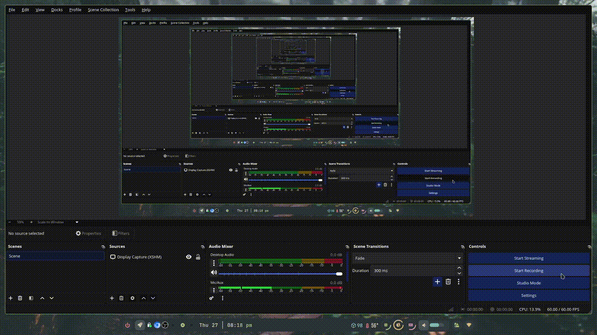

#  ghpeek  
Terminal GitHub Profile Previewer (with Contribution Graph)

`ghpeek` is a fully terminal-native GitHub profile visualizer.  
It shows:

- Profile name, bio, join date  
- Repo summary  
- Contribution graph (via Playwright-rendered page, token needed)  
- Nerd Font–based graph blocks  
- Automatically configures itself  
- No pip installs required  

---

## 🚀 Quick Install

```bash
curl -s https://raw.githubusercontent.com/V1337Q/ghpeek/main/install.sh | bash
```

## Preview 



## NOTICE!

Don't forget to export your github token in order to render the contribution graph and other graphics.

In your terminal:

```bash
export GITHUB_TOKEN=your_github_token
```
